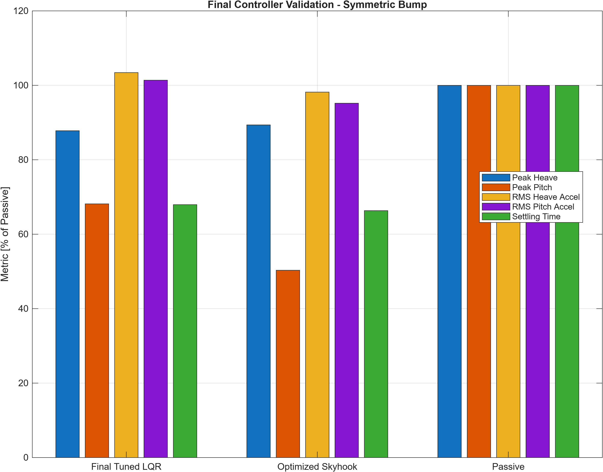
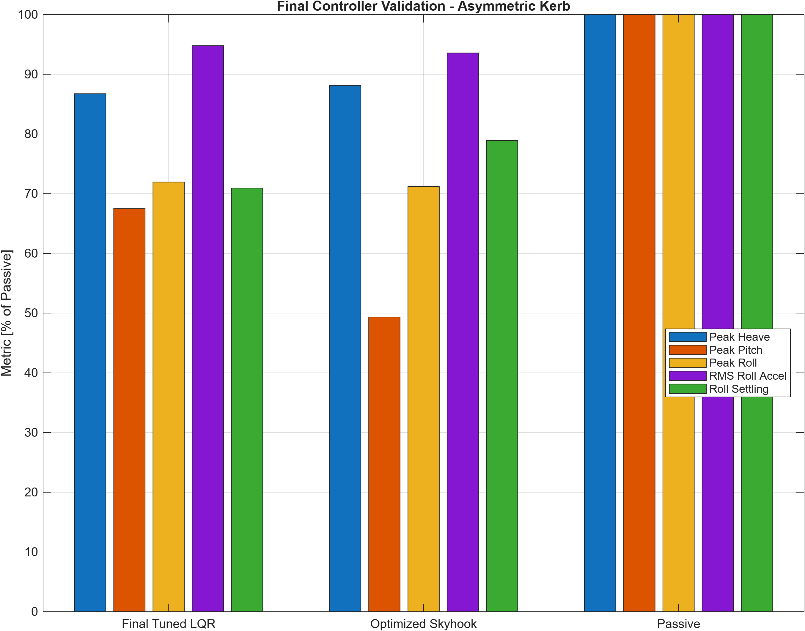
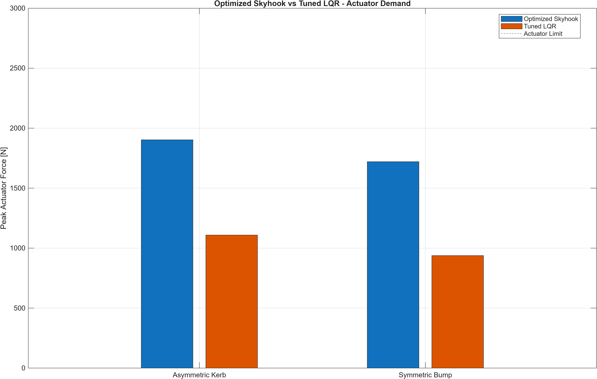
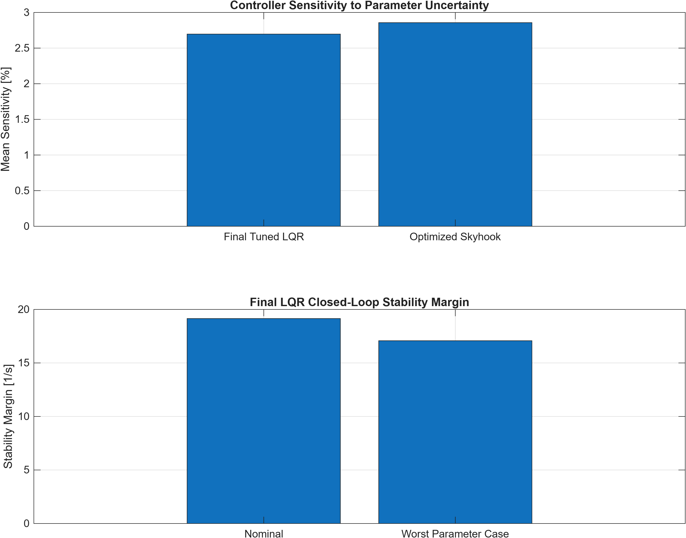
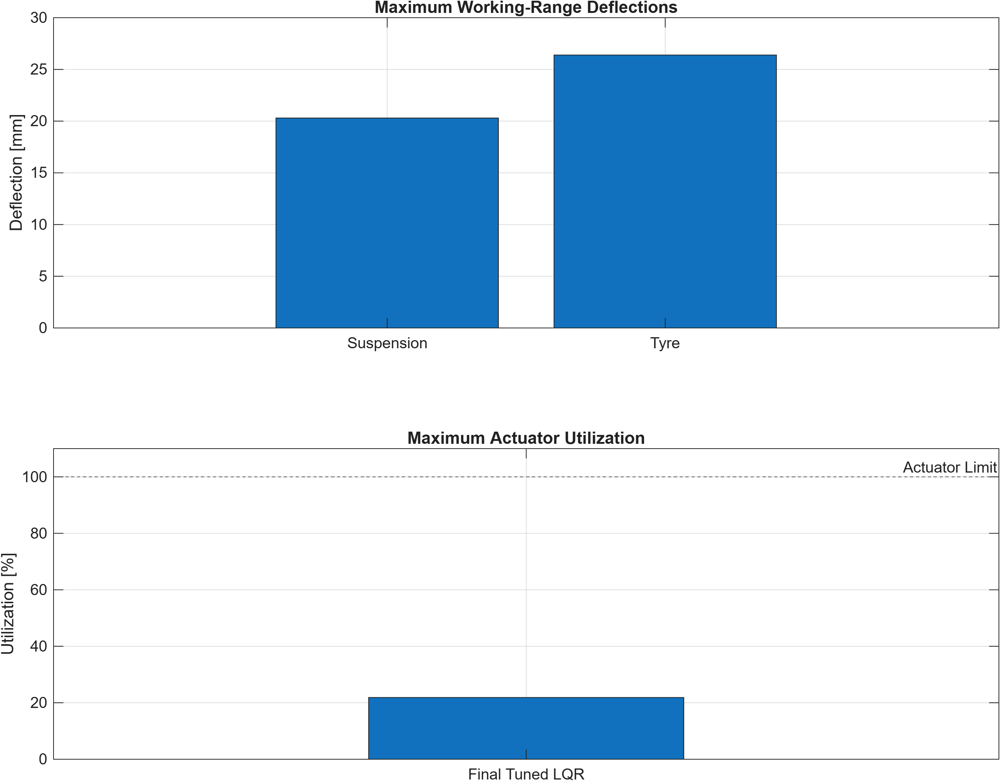
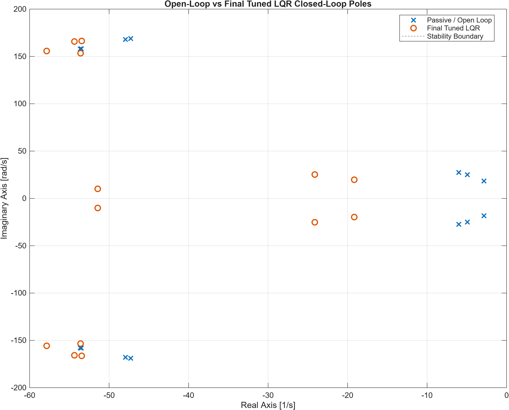
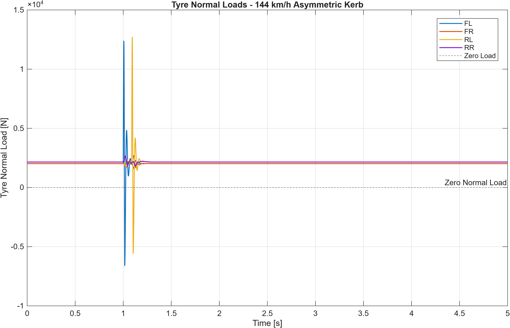

# 7-DOF Active Suspension Modelling and Control for a Race Vehicle

This MATLAB/Simulink project develops a full-car 7-DOF vertical-dynamics model for a race vehicle, establishes and verifies its passive simulation baseline, integrates four active-suspension actuators, and compares optimized Skyhook control with a full-state LQR controller. The controllers are tuned and evaluated using symmetric bumps, an asymmetric left-side kerb, frequency-response testing, vehicle-speed variation, parameter uncertainty, closed-loop stability analysis, suspension working range, tyre-load indicators, and actuator demand. Within the evaluated test programme, the selected **Final Tuned LQR** provides the strongest overall compromise between body-motion control, robustness, settling and actuator effort; all results are simulation-based.

## Key engineering objectives

- Reduce sprung-mass heave, pitch and roll.
- Improve transient settling without excessive actuator demand.
- Compare Passive, optimized Skyhook and tuned LQR control on common tests.
- Verify closed-loop stability and sensitivity to vehicle-parameter uncertainty.
- Assess suspension deflection, velocity and actuator working range.
- Investigate tyre unloading/contact-loss indicators under aggressive kerb excitation.

## Vehicle model

The model contains seven vertical-dynamics degrees of freedom:

| Component | Degrees of freedom |
|---|---|
| Sprung mass | Heave, pitch and roll |
| Unsprung masses | Front-left, front-right, rear-left and rear-right wheel hop |

Each corner includes suspension stiffness and damping, tyre vertical stiffness and an active force input. Front/rear geometry maps corner forces into body heave, pitch and roll. Four road-displacement inputs excite the tyres independently, allowing symmetric and asymmetric tests.

The LQR plant uses the following 14-state vector:

```text
x = [
    z_s
    theta
    phi
    z_u_FL
    z_u_FR
    z_u_RL
    z_u_RR
    z_s_dot
    theta_dot
    phi_dot
    z_u_FL_dot
    z_u_FR_dot
    z_u_RL_dot
    z_u_RR_dot
]
```

## Control architecture

| Mode | Description |
|---|---|
| Passive | Active-force commands disabled; establishes the validation baseline. |
| Optimized Skyhook | Body-velocity feedback with the selected Skyhook gain of 6000 N·s/m. |
| Final Tuned LQR | Full-state feedback using a normalized 14-state model and final Q/R scaling ratio of 0.125. |

The Simulink controller selector routes either Skyhook or LQR commands through the same four-corner actuator interface. Each actuator is limited to **±3000 N**, enabling like-for-like performance and force-demand comparisons.

## Test programme

- Symmetric bump for heave, pitch, acceleration, settling and actuator demand.
- Asymmetric left-side kerb for coupled heave, pitch and roll behaviour.
- Passive frequency sweep for body and wheel-hop response.
- Skyhook gain sweep and weighted gain selection.
- LQR state-space validation, controllability checks and Q/R weight sweeps.
- Vehicle-speed sensitivity from the nominal condition to 144 km/h.
- High-speed asymmetric-kerb and suspension working-range assessment.
- Nominal and parameter-variation robustness cases.
- Open-loop and closed-loop pole/stability verification.

## Key results

### Symmetric bump

| Metric | Passive | Optimized Skyhook | Final Tuned LQR |
|---|---:|---:|---:|
| Peak heave [mm] | 2.3982 | 2.1434 | **2.1057** |
| Peak pitch [deg] | 0.16387 | **0.082475** | 0.11169 |
| RMS heave acceleration [m/s²] | 0.94096 | **0.92388** | 0.97314 |
| RMS pitch acceleration [deg/s²] | 55.858 | **53.170** | 56.628 |
| Settling time [s] | 2.106 | **1.397** | 1.431 |
| Peak actuator force [N] | 0 | 1720.7 | **937.9** |

Relative to passive suspension, the Final Tuned LQR reduced peak heave by **12.20%**, peak pitch by **31.84%**, and settling time by **32.05%**. It did not improve the two RMS acceleration metrics: heave acceleration rose by about 3.4% and pitch acceleration by about 1.4%. This is an explicit tuning trade-off, not an omitted result.



### Asymmetric kerb

| Metric | Passive | Optimized Skyhook | Final Tuned LQR |
|---|---:|---:|---:|
| Peak heave [mm] | 1.7215 | 1.5172 | **1.4934** |
| Peak pitch [deg] | 0.11662 | **0.057550** | 0.078727 |
| Peak roll [deg] | 0.20380 | **0.14509** | 0.14662 |
| RMS roll acceleration [deg/s²] | 84.010 | **78.601** | 79.646 |
| Roll settling time [s] | 1.844 | 1.455 | **1.308** |
| Peak actuator force [N] | 0 | 1903.0 | **1109.1** |

Against the passive baseline, the Final Tuned LQR reduced peak heave by **13.25%**, peak pitch by **32.49%**, peak roll by **28.06%**, and roll settling time by **29.07%**.



### Robustness, stability and working range

| Result | Final Tuned LQR | Optimized Skyhook |
|---|---:|---:|
| Mean parameter sensitivity | **2.6966%** | 2.8570% |
| Worst robustness peak actuator force | **959.89 N** | 1720.7 N |
| Stable parameter-variation cases | All tested | All tested |

The LQR nominal closed-loop stability margin was **19.149 s⁻¹**. The worst tested margin was **17.076 s⁻¹** for the +10% sprung-mass case. Other robustness cases used −10% suspension stiffness, −10% damping and −10% tyre stiffness; every tested closed-loop case remained stable.

At 144 km/h in the asymmetric-kerb test, maximum suspension deflection was **20.298 mm**, maximum suspension velocity was **2.668 m/s**, and maximum tyre deflection was **26.392 mm**. Maximum actuator utilization was only **21.865%** of the 3000 N limit. However, the linear tyre model predicted a minimum normal load of **−6603.4 N** and contact-loss indication for up to **0.25995%** of the simulation. Negative predicted load is non-physical and indicates that the linear tyre/contact assumptions have exceeded their valid range; it is not evidence of measured tyre lift.

<details>
<summary>Supporting validation figures</summary>











</details>

## Engineering interpretation

The Final Tuned LQR was selected because it combines improved heave, pitch, roll and settling with substantially lower actuator demand than optimized Skyhook. Skyhook remains better in several pitch and acceleration metrics, particularly in the symmetric-bump test, but required roughly 83% more peak force than LQR for the bump and 72% more for the kerb. LQR also retained a slightly lower mean sensitivity across the tested parameter variations.

The evaluated actuator capacity is not the limiting concern: all controller and operating-envelope cases remained comfortably below ±3000 N. The critical limitation is wheel/tyre behaviour during severe high-speed kerb excitation, where the linear tyre model predicts brief unloading beyond its physically valid contact range. The result motivates a unilateral, nonlinear tyre-contact model before making claims about grip or track performance.

## Repository structure

```text
7DOF_Active_Suspension_RaceCar/
├── README.md
├── LICENSE
├── .gitignore
├── setup_project.m
├── Model/
│   ├── RaceCar_7DOF_ActiveSuspension.slx
│   └── Subsystems/
├── Scripts/
│   ├── 01_Parameters/
│   ├── 02_Passive_Validation/
│   ├── 03_Skyhook/
│   ├── 04_LQR/
│   ├── 05_Operating_Envelope/
│   └── 06_Final_Validation/
├── Results/
│   ├── Passive/
│   ├── Skyhook/
│   ├── LQR/
│   ├── Robustness/
│   ├── Operating_Envelope/
│   └── Final/
├── Plots/
│   ├── Passive/
│   ├── Skyhook/
│   ├── LQR/
│   ├── Robustness/
│   ├── Operating_Envelope/
│   └── Final/
├── Docs/
│   ├── Technical_Report/
│   ├── Figures/
│   └── Portfolio/
└── Data/
    └── README.md
```

Folder-specific guidance is available in [Scripts](Scripts/README.md), [Results](Results/README.md), [Plots](Plots/README.md), [Model](Model/README.md), and [Data](Data/README.md).

## Software and methods

- MATLAB and Simulink
- Control System Toolbox (`lqr`, `ctrb`, modal damping/pole analysis)
- State-space modelling and normalized full-state feedback
- Numerical post-processing, parameter sweeps and data visualization

## How to run

The repository includes validated CSV, MAT, text and figure outputs, so the results can be reviewed without rerunning MATLAB. To reproduce or extend the simulations:

1. Open MATLAB in the repository root and configure the project paths:

   ```matlab
   run('setup_project.m');
   run(fullfile('Scripts', '01_Parameters', 'vehicle_parameters.m'));
   ```

2. Open the Simulink model:

   ```matlab
   open_system(fullfile('Model', 'RaceCar_7DOF_ActiveSuspension.slx'));
   ```

3. Reproduce the passive baseline with `active_mode = 0`, simulate the required bump, kerb or frequency-sweep input, and run the matching scripts in `Scripts/02_Passive_Validation/`.
4. Run the actuator-interface, gain-sweep, optimization and verification scripts in `Scripts/03_Skyhook/`.
5. Run `validate_lqr_state_space.m`, `check_lqr_controllability.m`, `design_initial_lqr.m`, the LQR sweep scripts, and `final_lqr_stability_verification.m` from `Scripts/04_LQR/`.
6. Run the speed, high-speed kerb, working-range and robustness studies in `Scripts/05_Operating_Envelope/`.
7. Run `final_controller_benchmark.m` followed by `final_validation_summary.m` in `Scripts/06_Final_Validation/`.

Several analysis stages consume MAT files created by earlier stages, and response-metric scripts expect the logged Simulink signals for their named test to be present. Follow the numbered workflow and retain the supplied signal names. Scripts resolve paths from their own locations and save outputs into the corresponding `Results/` and `Plots/` categories.

## Limitations

- The vehicle model uses linear vertical-dynamics assumptions.
- Tyres are represented by vertical stiffness rather than a full nonlinear tyre model.
- Tyre contact-loss results are model-based indicators, not measured tyre lift.
- Lateral, longitudinal and yaw dynamics are outside the current model scope.
- Actuator bandwidth and internal hydraulic/electric dynamics are not represented.
- No physical rig, hardware-in-the-loop or track validation has yet been completed.

## Future work

- Add nonlinear dampers, bump stops and unilateral tyre contact.
- Introduce actuator bandwidth, delay, power and thermal constraints.
- Investigate semi-active, MPC and adaptive-control architectures.
- Add a state observer or Kalman filter for implementable state estimation.
- Couple aero load, nonlinear tyre behaviour and lap simulation.
- Use telemetry or rig data for parameter identification and controller tuning.
- Progress through hardware-in-the-loop testing to physical validation.

## Project documentation

- [Final engineering summary](Docs/Technical_Report/final_engineering_summary.md)
- [Final showcase figures](Plots/Final/README.md)
- [Repository completion checklist](Docs/repository_checklist.md)

## License

Released under the [MIT License](LICENSE).
